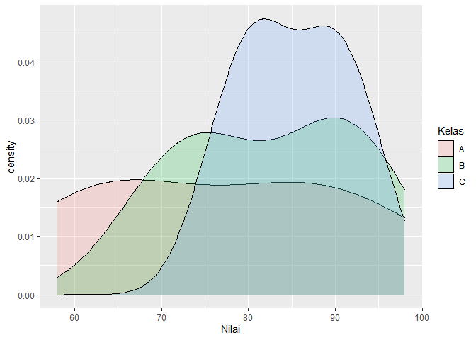
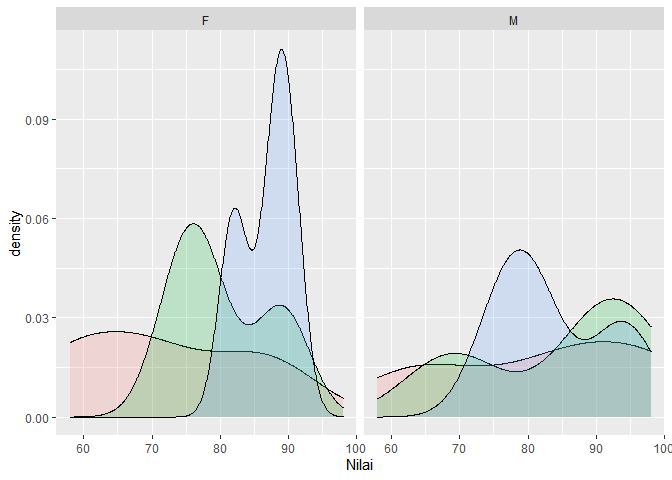
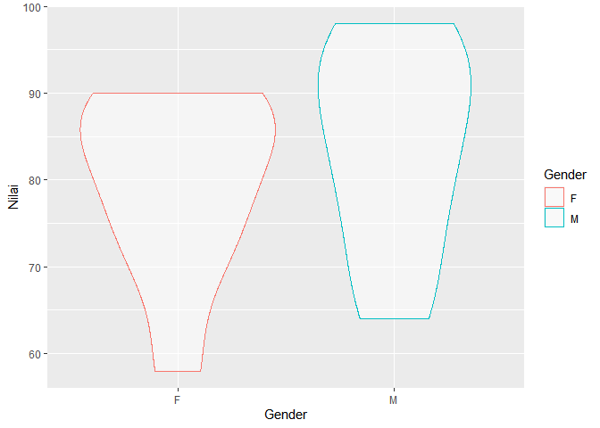

Introduction to R
================
Riki Herliansyah,
21/11/2021

## Mengenal interface RStudi


Tampilan RStudio terdiri dari beberapa jendela yaitu:

1.  Jendela Console/Command Line yang terletak pada bagian sebelah kiri
    bawah yang disebut juga sebagai jendela Command. Pada jendela ini,
    kita dapat menuliskan perintah setelah tanda “-\>” dan R akan
    mengeksekusi perintah tersebut.
2.  Jendela Editor juga disebut jendela Script. Perintah yang kita
    tuliskan pada jendela Console pada dasarnya tidak dapat simpan,
    sehingga kita harus menuliskan kembali setiap kali kita membuka R.
    Jendela Script memungkinkan kita untuk menyimpan dan mengedit
    perintah yang kita tuliskan.
3.  Jendela Environment/ History yang terletak pada bagian sebelah kanan
    atas. Pada jendela ini tersedia pilihan Import Dataset yang
    memberikan kita pilihan untuk mengimport data secara langsung dari
    berbagai jenis file diantara lain CSV, Excel, SPSS, SAS dan Stata.
    Jendela history menunjukkan pekerjaan yang telah kita ketikan
    sebelumnya.
4.  Jendela yang keempat adalah files/ plots/ packages/ help. Pada
    jendela ini kita dapat membuka file, melihat grafik, menginstal dan
    memuat package atau menggunakan fungsi help untuk mencari penjelasan
    mengenai syntax atau fungsi tertentu.

## Packages()

Packages adalah kumpulan-kumpulan dari fungsi R, kompilasi kode dan
contoh data. Packages ini disimpan dalam sebuah wadah yang disebut
“library”. Perintah berikut ini adalah untuk melihat daftar packages
yang telah terinstal secara otomatis di RStudio kita.

``` r
library()
```

Packages dapat diinstal secara langsung dari sebuah resiptory atau dari
sebuah file yang sebelumnya sudah didownload. Untuk menginstal packages,
kita menggunakan perintah:

``` r
install.packages("nama packages")
```

Untuk menggunakan packages yang sudah terinstal, kita dapat menggunakan
perintah:

``` r
library(namapackages)
```

Misal kita ingin menggunakan fungsi ggplot yang terdapat pada package
ggplot2(), maka kita perlu memanggil library tersebut seperti contoh
berikut:

``` r
library(ggplot2)
mtcars %>%
  ggplot(mapping=aes(x=wt, y=mpg)) +
  geom_line()
```


## Files

Dalam menggunakan Rstudio, sebaiknya kita menggunakan directory yang
berbeda untuk masing-masing project. Kita bisa mengatur direktori kerja
R dengan menggunakan perintah:

``` r
setwd("the_directory_path")
```

Disarankan juga untuk membuat project yang berbeda untuk setiap
perkejaan yang kita lakukan sehingga mudah untuk berpindah dari satu
project ke project yang lain.

## Commands and Objects

Perintah di R selalu diakhiri dengan tanda kurung tutup, (). Dua
perintah yang dituliskan dalam baris yang harus dipisah dengan
menggunakan “;”. Jika kita membuat sebuah objek dengan nilai tertentu
maka kita harus menuliskan terlebih dahulu nama vobjek tersebut diikuti
dengan tanda “\<-” atau “=” baru kemudian nilai. Spasi tidak berpengaruh
pada perintah, tetapi tidak boleh ada spasi dalam nama variabel.
Penggunaan huruf kecil dan besar berpengaruh pada perintah di R. Untuk
melihat objek yang kita buat, kita dapat menggunakan perintah “print()”
atau cukup dengan menuliskan nama object tersebut.

``` r
a <- 17; b = 10
a; print(b)
```

    ## [1] 17

    ## [1] 10

Adapun operasi matematika di R serupa dengan bahasa pemprograman pada
umumnya seperti ditunjukkan pada contoh berikut.

``` r
a = 17; b = 12
a + b
```

    ## [1] 29

``` r
a - b
```

    ## [1] 5

``` r
a * b
```

    ## [1] 204

``` r
a / b
```

    ## [1] 1.416667

``` r
a^2
```

    ## [1] 289

``` r
sqrt(b)
```

    ## [1] 3.464102

``` r
log(a)
```

    ## [1] 2.833213

``` r
exp(a-b)
```

    ## [1] 148.4132

## Mengenal Data Type in R

Pada umumnya, R memiliki 6 jenis tipe data yaitu:

| Types     | Example                             |
|-----------|-------------------------------------|
| Logical   | TRUE, FALSE                         |
| Integer   | 4L, 17L, 12L                        |
| Numeric   | 4.12, 17, 12                        |
| Character | “good”, ‘TRUE’                      |
| Complex   | 12 + 17i                            |
| Raw       | “Hello” is stored as 48 65 6c 6c 6f |

``` r
logcl = TRUE
brth = 17L
nmrc = 17
chr = "good"
com = 17i
class(logcl); class(brth); class(nmrc)
```

    ## [1] "logical"

    ## [1] "integer"

    ## [1] "numeric"

``` r
class(com); class(chr)
```

    ## [1] "complex"

    ## [1] "character"

## Data Structures in R

Ada beberapa struktur data di R diantaranya adalah vektor, list,
matriks, arrays dan data frames. Vektor adalah struktur data paling
sederhana di R. Indeks vektor di R menggunakan simbol “\[i\]” dimana i
adalah elemen ke- dari vektor. Untuk membuat vektor kita dapat
menggunakan perintah c() atau beberapa perintah lain seperti seq().

``` r
x = 1:10; x
```

    ##  [1]  1  2  3  4  5  6  7  8  9 10

``` r
z = seq(1,10,1); z
```

    ##  [1]  1  2  3  4  5  6  7  8  9 10

``` r
y <- c(1,2,3,4,5); y
```

    ## [1] 1 2 3 4 5

``` r
y2 <- 2*y + 3
length(y2)
```

    ## [1] 5

Struktur data berikutnya adalah matriks yang merupakan gabungan dari
vektor. Indeks matriks di R menggunakan simbol “\[i,j\]” dimana i
menujukkan baris dan j menujukkan kolom. Untuk membuat matriks kita
dapat menggunakan perintah matrix().

``` r
A = matrix(1:12, ncol = 3)
A
```

    ##      [,1] [,2] [,3]
    ## [1,]    1    5    9
    ## [2,]    2    6   10
    ## [3,]    3    7   11
    ## [4,]    4    8   12

``` r
B = matrix(1:12, nrow = 4, byrow = TRUE)
B
```

    ##      [,1] [,2] [,3]
    ## [1,]    1    2    3
    ## [2,]    4    5    6
    ## [3,]    7    8    9
    ## [4,]   10   11   12

``` r
is.matrix(A)
```

    ## [1] TRUE

Kemudian terdapat pula jenis struktur data “list()” yang merupakan
kumpulan berbagai struktur data. Tipe data yang terdapat pada list tidak
harus sama seperti matriks atau vektor.

``` r
A = matrix(1:6, ncol = 3)
x = list(matriks=A, text="good", bool=TRUE, vektor= c(1,2,3,4))
x
```

    ## $matriks
    ##      [,1] [,2] [,3]
    ## [1,]    1    3    5
    ## [2,]    2    4    6
    ## 
    ## $text
    ## [1] "good"
    ## 
    ## $bool
    ## [1] TRUE
    ## 
    ## $vektor
    ## [1] 1 2 3 4

Tipe selanjutnya adalah arrays. Array merupakan kumpulan matriks
sehingga array biasanya memiliki 3 dimensi yaitu baris, kolom dan
matriks ke-.

``` r
array(1:12, dim=c(2,3,2))
```

    ## , , 1
    ## 
    ##      [,1] [,2] [,3]
    ## [1,]    1    3    5
    ## [2,]    2    4    6
    ## 
    ## , , 2
    ## 
    ##      [,1] [,2] [,3]
    ## [1,]    7    9   11
    ## [2,]    8   10   12

Yang terakhir adalah data frames. Data frames memiliki struktur yang
mirip dengan matriks hanya saja tipe data pada setiap kolom tidak harus
sama seperti matriks.

``` r
A = c(1,4,5,10,2)
B = c("M","F","M","M","F")
C = c(17L, 12L, 92L, 10L, 10L)
H = data.frame(A=A, B=B, C=C)
H
```

    ##    A B  C
    ## 1  1 M 17
    ## 2  4 F 12
    ## 3  5 M 92
    ## 4 10 M 10
    ## 5  2 F 10

## Indexing in R

Indeks sangat penting untuk diketahui karena kadang bisa sedikit
menghambat dalam menyusun fungsi jika kita tidak familiar dengan
indexing rule. R menggunakan “\[\]” sebagai indeksnya. Misalnya vektor,
karena hanya satu dimensi maka indeks vektor adalah “\[i\]” dimana i
menujukkan elemen vektor.

``` r
x = 1:10
x[1]; x[-1]; x[1:2]; x[c(1,3)]
```

    ## [1] 1

    ## [1]  2  3  4  5  6  7  8  9 10

    ## [1] 1 2

    ## [1] 1 3

``` r
x[x < 5]
```

    ## [1] 1 2 3 4

Sedangkan untuk matriks menggunakan “\[i,j\]” dimana i menujukkan elemen
baris dan j elemen kolom.

``` r
A = matrix(1:12, ncol = 3)
A[1,]; A[,2]
```

    ## [1] 1 5 9

    ## [1] 5 6 7 8

``` r
A[1,1]
```

    ## [1] 1

List menggunakan rule indeks yang sedikit berbeda. List menggunakan
indeks “\[\[i\]\]” atau “$” untuk memanggil elemennya.

``` r
A = matrix(1:6, ncol = 3)
x = list(matriks=A, text="good", bool=TRUE, vektor= c(1,2,3,4))
x[[2]]; x$text
```

    ## [1] "good"

    ## [1] "good"

Adapun array menggunakan indeks yang mirip dengan matriks akan tetapi
terdapat satu dimensi tambahan yaitu “\[n,i,j\]” dimana n menujukkan
matriks ke-.

``` r
ar = array(1:12, dim=c(2,3,2))
ar[1,,]
```

    ##      [,1] [,2]
    ## [1,]    1    7
    ## [2,]    3    9
    ## [3,]    5   11

``` r
ar[1,2,]
```

    ## [1] 3 9

``` r
ar[2,1,1]
```

    ## [1] 2

Yang terakhir adalah indeks pada data frames. Data frames menggunakan
indeks yang serupa dengan matriks dan list yaitu “\[i,j\]” atau “$”.

``` r
A = c(1,4,5,10,2)
B = c("M","F","M","M","F")
C = c(17L, 12L, 92L, 10L, 10L)
H = data.frame(A=A, B=B, C=C)
H$A
```

    ## [1]  1  4  5 10  2

``` r
H[,1]
```

    ## [1]  1  4  5 10  2

``` r
H[1,2]
```

    ## [1] "M"

## Logical Operation and Loops

R memberikan opsi kepada pengunanya untuk menulis sendiri fungsi
tertentu. Dalam pembuatan fungsi, kita sering menggunakan penyataan
logical operation seperti if dan perulangan seperti for, while ke dalam
fungsi kita. Perintah if digunakan ketika kita ingin meletakkan sebuah
kondisi pada perintah tertentu.

``` r
fruits <- "apple"
if(fruits == "apple"){
  "i want it"
} else {
  "give me something else"
}
```

    ## [1] "i want it"

``` r
ifelse(fruits != "apple", "i want it", "give me something else")
```

    ## [1] "give me something else"

Berikut adalah beberapa operator yang digunakan dalam logika.

``` r
a = 17; b <- 10
a < b; a >= b
```

    ## [1] FALSE

    ## [1] TRUE

``` r
a != b
```

    ## [1] TRUE

``` r
(b-3 == a) & (a > b)
```

    ## [1] FALSE

``` r
(b == a) | (b < a)
```

    ## [1] TRUE

Untuk membuat perulangan (loops), kita dapat menggunakan for() atau
while(). Berikut adalah contoh bagaimana for() dan while() digunakan.

``` r
x = 1:10
n = length(x)
s = numeric()
for (i in 1:n) {
  s[i] = 10 - 0.2*x[i]
}
s
```

    ##  [1] 9.8 9.6 9.4 9.2 9.0 8.8 8.6 8.4 8.2 8.0

``` r
i = 0
while(i <= n){
  s[i] = 10 - 0.2*x[i]
  i = i + 1
}
s
```

    ##  [1] 9.8 9.6 9.4 9.2 9.0 8.8 8.6 8.4 8.2 8.0

## Input Data di R

Pada sesi sebelumnya kita sudah membahas beberapa strutktur data di R.
Secara tidak langsung kita sudah belajar bagaimana menginput data di R.
Untuk lebih detail, kita akan ringkas beberapa cara menginput data di R.

| Perintah   | Pengertian                  |
|------------|-----------------------------|
| c()        | membuat vektor              |
| matrix()   | membuat matriks             |
| data.frame | membuat struktur data frame |
| list()     | membuat struktur list       |

Pertama, kita akan menginput vektor di R. Misalkan kita ingin menginput
hasil UAS matematika dengan nilai sebagai berikut 80,55, 65, 78, 54, dan
90. Berikut perintah yang dapat digunakan untuk menginput data tersebut
di R:

``` r
nilai <- c(80, 55, 65, 78, 54, 90)
nilai
```

    ## [1] 80 55 65 78 54 90

Selanjutnya akan ditunjukkan bagaimana menginput sebuah data dengan
jenis matriks.

``` r
matriks_nilai <- matrix(nilai, nrow = 2)
matriks_nilai
```

    ##      [,1] [,2] [,3]
    ## [1,]   80   65   54
    ## [2,]   55   78   90

``` r
matriks_nilai <- matrix(nilai, nrow = 2, byrow = TRUE)
matriks_nilai
```

    ##      [,1] [,2] [,3]
    ## [1,]   80   55   65
    ## [2,]   78   54   90

Jenis data berikutnya adalah data frames. Data frames merupakan sebuah
matriks dimana kita dapat menuliskan nama variabel untuk setiap kolom
data yang diinput. Misalkan kita memiliki sebuah data sebagai berikut:

| A    | B   | C    |
|------|-----|------|
| 70   | 74  | 88   |
| 85   | 69  | 76.5 |
| 86.5 | 89  | 82   |
| 58   | 78  | 90   |
| 98   | 95  | 94   |
| 64   | 90  | 81   |

``` r
nilai_data_frame <- data.frame(A = c(70, 85, 86.5, 58, 98, 64),
                               B = c(74, 69, 89, 78, 95, 90),
                               C = c(88, 76.5, 82, 90, 94, 81))
nilai_data_frame
```

    ##      A  B    C
    ## 1 70.0 74 88.0
    ## 2 85.0 69 76.5
    ## 3 86.5 89 82.0
    ## 4 58.0 78 90.0
    ## 5 98.0 95 94.0
    ## 6 64.0 90 81.0

Bagaimana jika data kita merupakan gabungan data non-numerik dan numerik
seperti berikut:

| A    | B   | C    | Gender |
|------|-----|------|--------|
| 70   | 74  | 88   | F      |
| 85   | 69  | 76.5 | M      |
| 86.5 | 89  | 82   | F      |
| 58   | 78  | 90   | F      |
| 98   | 95  | 94   | M      |
| 64   | 90  | 81   | M      |

``` r
nilai_data_frame <- data.frame(A = c(70, 85, 86.5, 58, 98, 64),
                               B = c(74, 69, 89, 78, 95, 90),
                               C = c(88, 76.5, 82, 90, 94, 81),
                               Gender = factor(c("F", "M", "F", "F", "M", "M")))
nilai_data_frame
```

    ##      A  B    C Gender
    ## 1 70.0 74 88.0      F
    ## 2 85.0 69 76.5      M
    ## 3 86.5 89 82.0      F
    ## 4 58.0 78 90.0      F
    ## 5 98.0 95 94.0      M
    ## 6 64.0 90 81.0      M

Tidak seperti aplikasi statistika lain pada umumnya, kita tidak dapat
menyalin sebuah data secara langsung ke R dengan menggunakan perintah
copy dan paste. Namun, RStudio memberikan kemudahan kepada para
penggunanya dengan menyediakan fitur “import data” dari berbagai format.


Cara lain untuk memudahkan proses penginputan data adalah dengan
mengatur direktori kerja di R menggunakan perintah

``` r
setwd("C:/Users/rikih/Documents/Tutorial")
```

Semua file yang tersimpan dalam folder Tutorial akan terbaca secara
otomatis oleh R. Misalkan kita ingin memanggil data berformat .csv yang
berasal dari folder tersebut maka kita cukup menggunakan perintah
seperti di bawah tanpa harus memanggil direktori di mana file tersebut
berada.

``` r
read.csv("nama.csv")
readxl::read_xls("nama.csv")
```

## Manipulasi Data

Kita sebenarnya bisa memanipulasi data yang kita import seperti
menambahkan kolom baru. Kita akan kembali ke tabel terakhir dan akan
membuat kolom baru yaitu total yang merupakan nilai A + B + C dan kolom
rata-rata yang merupakan total/3.

``` r
nilai_data_frame <- nilai_data_frame %>%
  mutate(total = A+B+C,
         rata_rata = total/3) %>%
  arrange()
nilai_data_frame
```

    ##      A  B    C Gender total rata_rata
    ## 1 70.0 74 88.0      F 232.0  77.33333
    ## 2 85.0 69 76.5      M 230.5  76.83333
    ## 3 86.5 89 82.0      F 257.5  85.83333
    ## 4 58.0 78 90.0      F 226.0  75.33333
    ## 5 98.0 95 94.0      M 287.0  95.66667
    ## 6 64.0 90 81.0      M 235.0  78.33333

Kita juga dapat menyaring data (filter) untuk menampilkan kategori
tertentu. Misal kita ingin melihat deskripsi nilai untuk jenis kelamin
laki-laki.

``` r
nilai_data_frame %>%
  group_by(Gender) %>%
  summarize(mean_gender = mean(rata_rata), 
              .groups = "drop") %>%
  arrange(desc(mean_gender))
```

    ## # A tibble: 2 x 2
    ##   Gender mean_gender
    ##   <fct>        <dbl>
    ## 1 M             83.6
    ## 2 F             79.5

``` r
nilai_data_frame %>%
  filter(Gender == "F") %>%
  arrange()
```

    ##      A  B  C Gender total rata_rata
    ## 1 70.0 74 88      F 232.0  77.33333
    ## 2 86.5 89 82      F 257.5  85.83333
    ## 3 58.0 78 90      F 226.0  75.33333

Selanjutnya, kita akan mengubah data kita dengan menggabungkan kolom A,
B dan C menjadi seperti berikut:

``` r
nilai_data_frame %>%
  pivot_longer(cols = c(1:3),
               names_to = "Kelas",
               values_to = "Nilai") %>%
  arrange()
```

    ## # A tibble: 18 x 5
    ##    Gender total rata_rata Kelas Nilai
    ##    <fct>  <dbl>     <dbl> <chr> <dbl>
    ##  1 F       232       77.3 A      70  
    ##  2 F       232       77.3 B      74  
    ##  3 F       232       77.3 C      88  
    ##  4 M       230.      76.8 A      85  
    ##  5 M       230.      76.8 B      69  
    ##  6 M       230.      76.8 C      76.5
    ##  7 F       258.      85.8 A      86.5
    ##  8 F       258.      85.8 B      89  
    ##  9 F       258.      85.8 C      82  
    ## 10 F       226       75.3 A      58  
    ## 11 F       226       75.3 B      78  
    ## 12 F       226       75.3 C      90  
    ## 13 M       287       95.7 A      98  
    ## 14 M       287       95.7 B      95  
    ## 15 M       287       95.7 C      94  
    ## 16 M       235       78.3 A      64  
    ## 17 M       235       78.3 B      90  
    ## 18 M       235       78.3 C      81

Berikut perintah yang dapat kita gunakan jika ingin memperoleh nilai
statistik (rata-rata, median, kuartil).

``` r
nilai_data_frame %>%
  pivot_longer(cols = c(1:3),
               names_to = "Kelas",
               values_to = "Nilai") %>%
  group_by(Kelas) %>%
  summarise(
    min  = min(Nilai, na.rm = TRUE),
    mean = mean(Nilai, na.rm = TRUE),
    med  = median(Nilai, na.rm = TRUE),
    sd   = sd(Nilai, na.rm = TRUE),
    iqr  = IQR(Nilai, na.rm = TRUE),
    max  = max(Nilai, na.rm = TRUE)
  ) %>%
  arrange()
```

    ## # A tibble: 3 x 7
    ##   Kelas   min  mean   med    sd   iqr   max
    ##   <chr> <dbl> <dbl> <dbl> <dbl> <dbl> <dbl>
    ## 1 A      58    76.9  77.5 15.3  20.6     98
    ## 2 B      69    82.5  83.5 10.3  14.8     95
    ## 3 C      76.5  85.2  85    6.51  8.25    94

## Grafik

Saya akan memberikan sedikit pengantar tentang cara membuat grafik di R
menggunakan package ggplot2(). Kita akan menggunakan data terakhir yang
sudah kita gabungkan.

``` r
library(ggplot2)

nilai_data_frame %>%
  pivot_longer(cols = c(1:3),
               names_to = "Kelas",
               values_to = "Nilai") %>%
  ggplot(aes(x=Nilai, fill=Kelas)) +
  geom_density(alpha=0.2)
```

<!-- -->

``` r
nilai_data_frame %>%
  pivot_longer(cols = c(1:3),
               names_to = "Kelas",
               values_to = "Nilai") %>%
  ggplot(aes(x=Nilai, fill=Kelas)) +
  geom_density(alpha=0.2) +
  facet_wrap(~Kelas, ncol=3) +
  guides(fill="none")
```

<!-- -->

``` r
nilai_data_frame %>%
  pivot_longer(cols = c(1:3),
               names_to = "Kelas",
               values_to = "Nilai") %>%
  ggplot(aes(x=Nilai, fill=Kelas)) +
  geom_density(alpha=0.2) +
  facet_wrap(~Gender) +
  guides(fill="none")
```

<!-- -->

Dan kita hanya perlu memilih visualisasi mana yang paling cocok untuk
menceritakan data kita. Beberapa opsi yang digunakan data seperti ini
adalah:

``` r
nilai_data_frame %>%
  pivot_longer(cols = c(1:3),
               names_to = "Kelas",
               values_to = "Nilai") %>%
  ggplot(aes(x=Nilai, fill=Gender)) +
  geom_histogram(alpha=0.5, binwidth=8) +
  facet_wrap(~Gender) +
  guides(fill="none")
```

<!-- -->

``` r
nilai_data_frame %>%
  pivot_longer(cols = c(1:3),
               names_to = "Kelas",
               values_to = "Nilai") %>%
  ggplot(aes(x=Gender, y=Nilai, color=Gender)) +
  geom_boxplot(alpha=0.5, binwidth=8) +
  guides(fill="none")
```

    ## Warning: Ignoring unknown parameters: binwidth

<!-- -->

``` r
nilai_data_frame %>%
  pivot_longer(cols = c(1:3),
               names_to = "Kelas",
               values_to = "Nilai") %>%
  ggplot(aes(x=Gender, y=Nilai, color=Gender)) +
  geom_violin(alpha=0.5, binwidth=8) +
  guides(fill="none")
```

    ## Warning: Ignoring unknown parameters: binwidth

<!-- -->
